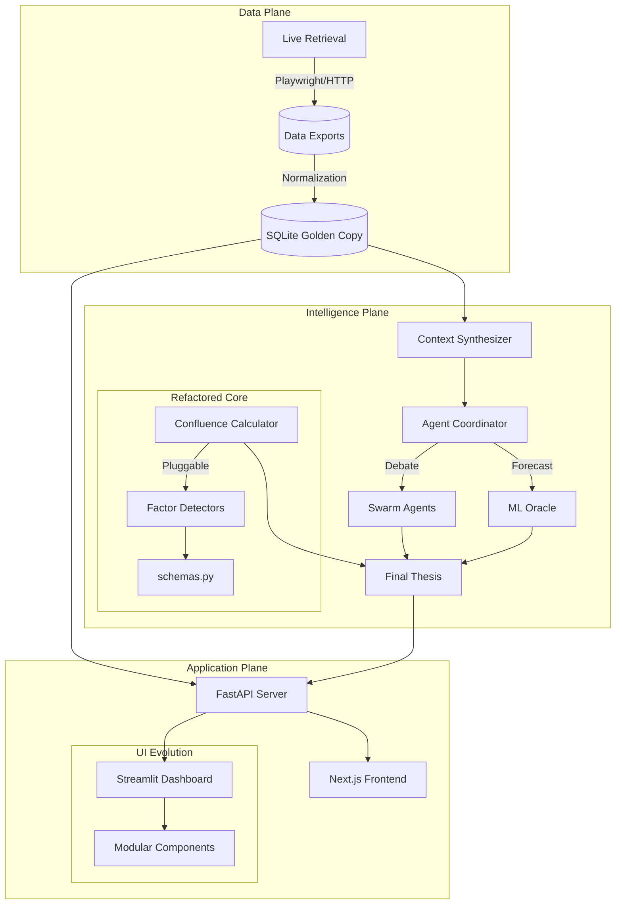

# Antigravity: Cognitive Micro-Analyst Swarm


**A high-fidelity financial intelligence engine that synthesizes "Ground Truth" market data through an adversarial swarm of AI agents and machine learning oracles.**

---

## 🏗️ System Architecture

Antigravity uses a decoupled, modular architecture with a pluggable intelligence layer.



---

## 🛠️ Technology Stack

### Backend (Python)
- **Framework**: FastAPI (High-performance API layer)
- **Intelligence**: LangChain & LangGraph (Multi-agent orchestration)
- **Data Science**: Pandas, NumPy, GARCH(1,1) via `arch` library
- **Web Scraping**: Playwright & Playwright-Stealth (Headless browser swarm)
- **Persistence**: SQLite (Institutional-grade local "Golden Copy")

### Frontend (Modern Stack)
- **Framework**: Next.js 15 (App Router, TypeScript)
- **UI/UX**: TailwindCSS, Framer Motion (Micro-animations)
- **Components**: Lucide React, Shadcn UI (inspired)
- **Dashboard**: Streamlit (Cyberpunk "Swarm Command" visualizer)

---

## 🚀 Quickstart

### 1. Environment Setup
```bash
# Clone the repository
git clone https://github.com/JackSmack1971/antigravity-microanalyst.git
cd antigravity-microanalyst

# Install Python dependencies
pip install -r requirements.txt
playwright install chromium

# Setup Frontend
cd frontend
npm install
cd ..

# Configure Environment
cp .env.example .env
# Add your OPENROUTER_API_KEY and other credentials to .env
```

### 2. Running the System

Antigravity operates in multiple layers. You can run them independently or together.

#### A. Data Pipeline (Backend)
```bash
# Fetch and normalize latest market data
python src/microanalyst/live_retrieval.py
python src/microanalyst/normalization.py
```

#### B. API Server
```bash
# Start the FastAPI v2.0 server
python src/microanalyst/api/server.py
```

#### C. Next.js App
```bash
# Run the high-fidelity web interface
cd frontend
npm run dev
```

#### D. Swarm Command (Streamlit)
```bash
# Launch the real-time visualizer
streamlit run src/microanalyst/reporting/visualizer_app.py
```

---

## 📊 System Components

- **Agent Coordinator**: Orchestrates specialized personas (Technical, Sentiment, Risk, Oracle) to debate market conditions.
- **ML Oracle**: A GARCH-powered forecasting engine providing T+24h price targets with automated retraining cycles.
- **Discovery Engine**: A headless browser pool that aggregates data from 11+ sources (Order Flow, On-Chain, ETF Flows).
- **Golden Copy DB**: A local SQLite instance acting as the source of truth for all normalized intelligence.

---

## 🔧 Maintenance & Verification
- **Test Suite**: Run `pytest` to verify core logic.
- **Verification Scripts**: Use `verify_*.py` in the root directory for functional checks (e.g., `python verify_swarm.py`).
- **Logs**: Monitor `logs/retrieval_log.txt` for pipeline health.

---

## 📄 License
MIT License.
