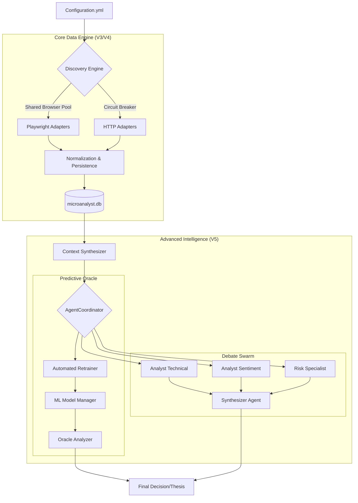

# Antigravity V3: Cognitive Micro-Analyst Swarm


**A "Ground Truth" financial intelligence engine that eliminates hallucination through deterministic data collection, local persistence, and adversarial LLM debate.**

---

## 🚀 Mission
To build an autonomous analyst that doesn't just "read" the market, but **understands** it.
1.  **Observe**: Headless browser swarm aggregates data from 11+ sources (Order Flow, On-Chain, Sentiment).
2.  **Remember**: Normalized data is persisted to a local "Golden Copy" SQLite database.
3.  **Think**: An adversarial swarm of LLM agents (Bull vs. Bear) debates the data to form a synthesized thesis.

---

## ⚡ Quickstart

### Prerequisites
- **Python 3.13+**
- **Playwright** (Chromium)
- **OpenRouter API Key** (for Swarm Intelligence)

### Installation

1.  **Clone and Setup**:
    ```bash
    git clone https://github.com/JackSmack1971/antigravity-microanalyst.git
    cd antigravity-microanalyst
    pip install -r requirements.txt
    playwright install chromium
    ```

2.  **Configure Environment**:
    ```bash
    cp .env.example .env
    # Edit .env and add your OPENROUTER_API_KEY
    ```

### Execution

**1. Data Collection & Persistence**
```bash
# Fetch live data (Shared Browser Pool + Circuit Breakers)
python src/microanalyst/live_retrieval.py

# Normalize and Upsert to SQLite (microanalyst.db)
python src/microanalyst/normalization.py
```

**2. Verify Intelligence**
```bash
# Run the Swarm Debate (Check verify_swarm.py)
python verify_swarm.py
```

---

## 🏗️ V5 Architecture: Synthetic Intelligence

### System Overview


### Key Components

#### 1. Discovery Engine & Persistence
-   **Shared Browser Pool**: Efficient multi-source aggregation (11+ endpoints).
-   **SQLite Golden Copy**: Local persistence of institutional-grade metrics.

#### 2. Multi-Agent Swarm Intelligence (`src/microanalyst/agents/`)
-   **AgentCoordinator**: Orchestrates specialized roles (Technical, Sentiment, Risk, Oracle).
-   **Role-Based Decomposition**: Complexity is handled by specialized microanalysts debating in a structured workflow.
-   **Self-Healing**: Dynamic error recovery and simulation fallbacks.

#### 3. Prediction Oracle (`src/microanalyst/intelligence/`)
-   **T+24h Forecasting**: Predicts directional bias and price targets.
-   **Automated Retraining**: Continuous ML lifecycle with dynamic resolution detection.
-   **Performance Gating**: New models are only promoted if they exceed a 2% improvement threshold over the active version.
-   **Dynamic Context**: Real-time Support/Resistance detection from live price action.

#### 4. Visual Intelligence & Swarm Command (V6)
-   **Streamlit Dashboard**: A high-fidelity "Cyberpunk Financial Terminal" for real-time monitoring.
-   **Swarm Command**: Visualizes the adversarial debate between personas (Retail, Whale, Macro).
-   **Predictive Charting**: Interactive T+24h forecasts with academic-grade precision.
-   **Safety Systems**: Integrated indicators for intelligence freshness and system health.

---

## 📊 Data & Schemas

### Microanalyst Database (`microanalyst.db`)
| Table | Description | Update Freq |
|-------|-------------|-------------|
| `btc_price_daily` | OHLC data from TwelveData | Daily |
| `etf_flows_daily` | Net Inflow/Outflow (USD/BTC) | Daily |

### Artifacts (`data_exports/`)
-   **JSON/HTML**: Raw responses from all adapters.
-   **Screenshots**: Visual evidence (Liquidation Heatmaps, Funding Rates).

---

## 🔧 Production Guide

### Scheduled Execution (Cron/Task Scheduler)
Recommended frequency: **Every 4 hours**.

```bash
cd /path/to/antigravity
python src/microanalyst/live_retrieval.py && python src/microanalyst/normalization.py
```

### Monitoring
-   **Logs**: Check `logs/retrieval_log.txt` for `Success Rate`.
-   **Database**: Run `python verify_db.py` to inspect recent writes.

---

## ⚠️ Known Issues
-   **CoinGecko Timeout**: The "Market Snapshot" adapter frequently times out due to heavy anti-bot protections. This is non-critical.
-   **Coinalyze 403s**: Aggressive IP blocking. Circuit breakers mitigate impact, but data may be stale if blocked.

---

## 📄 License
MIT License.
