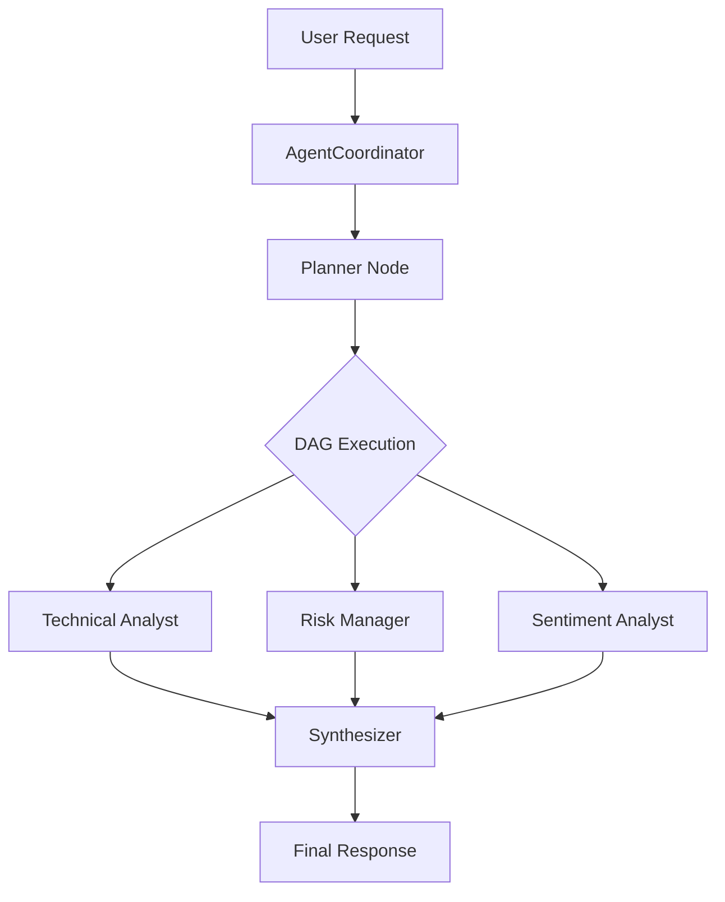

# Agent Coordinator Developer Guide

The **Agent Coordinator** (`agent_coordinator.py`) is the central nervous system of the Microanalyst. It breaks down complex user objectives into atomic tasks and delegates them to specialized roles (e.g., `ANALYST_TECHNICAL`, `RISK_MANAGER`) in a Directed Acyclic Graph (DAG) execution flow.

## 🏗️ Architecture

1.  **Orchestrator**: Parses the user's high-level goal.
2.  **Planner**: Decomposes the goal into a DAG of sub-tasks using topological sorting.
3.  **Executors**: Specialized Agents that perform atomic units of work.
4.  **Synthesizer**: Aggregates all outputs into a final cohesive response.



---

## 🚀 How to Add a New Specialist Role

Want to add a `NEWS_ANALYST` or `FUNDAMENTAL_RESEARCHER`? Follow these 4 steps.

### Step 1: Register the Role

Open `src/microanalyst/agents/agent_coordinator.py` and add your new role to the `AgentRole` Enum.

```python
class AgentRole(str, Enum):
    COORDINATOR = "coordinator"
    DATA_COLLECTOR = "data_collector"
    # ... existing roles ...
    NEWS_ANALYST = "news_analyst"  # <--- Add this!
```

### Step 2: Define the System Prompt

In `agent_coordinator.py`, locate the `AGENT_PROMPTS` dictionary and define the persona and instructions for your new agent.

```python
AGENT_PROMPTS = {
    # ...
    AgentRole.NEWS_ANALYST: """
    You are an EXPERT News Analyst.
    Your goal: Synthesize breaking news headlines into market impact assessments.
    Output:
    - Key Driver: [Main news event]
    - Impact: [Bullish/Bearish/Neutral]
    - Validity: [Rumor/Confirmed]
    """
}
```

### Step 3: Implement the Logic

If your agent needs specific tools (like fetching RSS feeds or scraping), implement the logic in a specialized module or helper function.

*Example: `src/microanalyst/agents/specialized/news.py`*

```python
def fetch_top_headlines(symbol: str):
    # Your logic here
    return ["Headline 1", "Headline 2"]
```

### Step 4: Register Delegation Logic

In `agent_coordinator.py`, locate the `_delegate_to_module` method. Add a handler for your new role.

```python
async def _delegate_to_module(self, role: AgentRole, inputs: Dict[str, Any]) -> Dict[str, Any]:
    # ...
    
    if role == AgentRole.NEWS_ANALYST:
        # 1. Call your custom logic
        # headlines = news.fetch_top_headlines(inputs['symbol'])
        
        # 2. Return data context for the LLM
        return {
            "headlines": ["Fed meeting minutes released", "Inflation drops"],
            "source": "Bloomberg Proxy"
        }
```

---

## ✅ Best Practices

*   **Atomic Responsibility**: Agents should do ONE thing well. Don't make a "General Analyst" who does everything.
*   **Context Isolation**: An agent only sees the inputs you explicitly pass to it.
*   **Failure Handling**: Always wrap external API calls in `try/except` blocks inside `_delegate_to_module` so one agent failing doesn't crash the whole pipeline.

## 🧪 Testing Your New Role

You can unit test the coordination logic without running the full LLM by mocking the `process_task` method.

See `tests/test_agent_coordinator.py` for inspiration.
